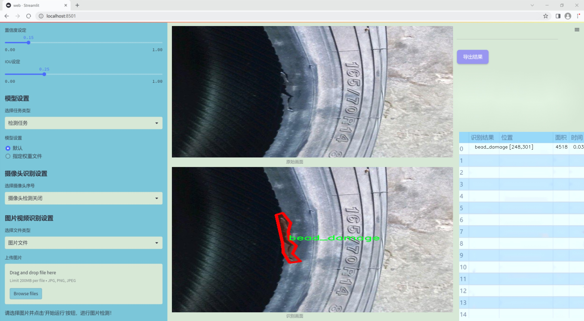
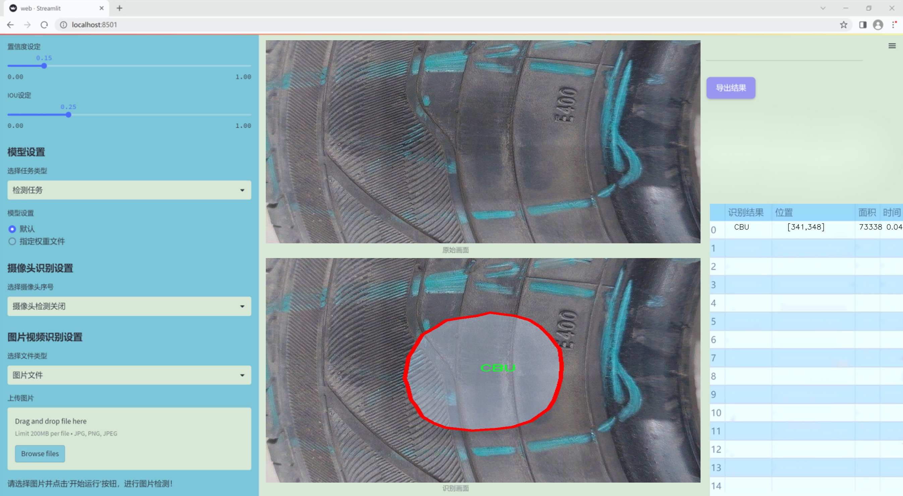
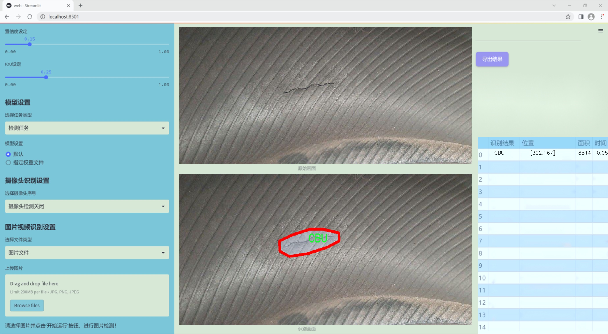
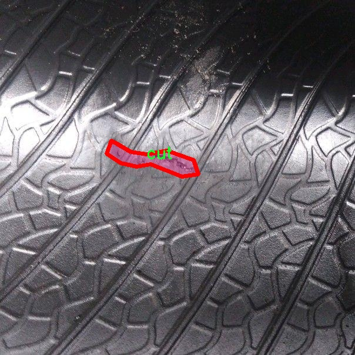
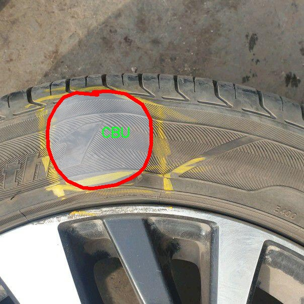
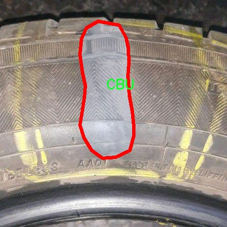
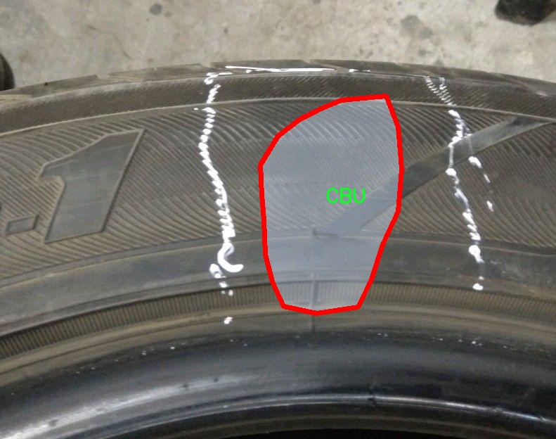
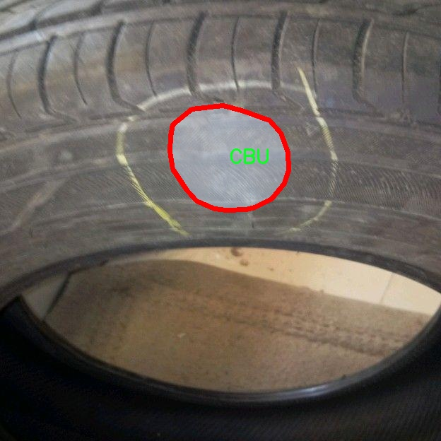

### 1.背景意义

研究背景与意义

随着汽车工业的快速发展，轮胎作为车辆安全和性能的重要组成部分，其质量直接影响到行车安全和驾驶体验。因此，轮胎表面缺陷的检测变得尤为重要。传统的人工检测方法不仅耗时耗力，而且容易受到人为因素的影响，导致漏检或误检的情况。为了提高检测的准确性和效率，基于计算机视觉的自动化检测技术逐渐成为研究的热点。

近年来，深度学习技术的快速发展为图像处理和物体检测提供了新的解决方案。YOLO（You Only Look Once）系列模型因其高效的实时检测能力和较高的准确率，广泛应用于各类物体检测任务。YOLOv11作为该系列的最新版本，结合了更为先进的网络结构和优化算法，能够在复杂环境中实现更为精确的目标检测。然而，针对轮胎表面缺陷的特定需求，现有的YOLOv11模型仍需进行改进，以适应轮胎表面缺陷检测的特点。

本研究基于改进的YOLOv11模型，构建一个针对轮胎表面缺陷的图像分割系统。数据集包含880张经过标注的轮胎缺陷图像，涵盖了四类缺陷：CBU（表面气泡）、bead_damage（胎圈损伤）、cut（切割）和tr（裂纹）。这些缺陷的准确识别与分割不仅有助于提高轮胎生产过程中的质量控制，还能为后续的维修和更换提供科学依据。通过对YOLOv11模型的改进与优化，本研究旨在提升轮胎表面缺陷检测的精度和效率，为智能制造和自动化检测技术的发展贡献力量。

### 2.视频效果

[2.1 视频效果](https://www.bilibili.com/video/BV1pHUrYSEHw/)

### 3.图片效果







##### [项目涉及的源码数据来源链接](https://kdocs.cn/l/cszuIiCKVNis)**

注意：本项目提供训练的数据集和训练教程,由于版本持续更新,暂不提供权重文件（best.pt）,请按照6.训练教程进行训练后实现上图演示的效果。

### 4.数据集信息

##### 4.1 本项目数据集类别数＆类别名

nc: 4
names: ['CBU', 'bead_damage', 'cut', 'tr']


该项目为【图像分割】数据集，请在【训练教程和Web端加载模型教程（第三步）】这一步的时候按照【图像分割】部分的教程来训练

##### 4.2 本项目数据集信息介绍

本项目数据集信息介绍

本项目旨在改进YOLOv11的轮胎表面缺陷检测图像分割系统，因此我们构建了一个专门针对轮胎缺陷的图像数据集。该数据集的主题围绕“缺陷”（defect），涵盖了轮胎表面可能出现的多种问题，以提高模型在实际应用中的准确性和鲁棒性。数据集中包含四个主要类别，分别为“CBU”（侧壁裂纹）、“bead_damage”（胎圈损伤）、“cut”（切割缺陷）和“tr”（胎面磨损）。这些类别的选择基于轮胎在使用过程中常见的缺陷类型，旨在帮助模型更好地识别和分割不同的缺陷区域。

数据集的构建过程包括收集大量高质量的轮胎图像，这些图像涵盖了不同的拍摄角度、光照条件和轮胎类型，以确保模型能够在多样化的环境中进行有效的学习。每个图像都经过精确标注，确保缺陷区域的边界清晰可见，从而为图像分割任务提供了可靠的训练数据。此外，为了增强模型的泛化能力，数据集中还包含了一些经过数据增强处理的图像，如旋转、缩放和颜色调整等。这些处理不仅丰富了数据集的多样性，还提高了模型在面对未知数据时的表现。

通过使用这一数据集，我们期望能够显著提升YOLOv11在轮胎表面缺陷检测中的性能，使其能够快速、准确地识别出各种缺陷类型，从而为轮胎质量监控和安全检测提供强有力的技术支持。整体而言，本项目的数据集为改进现有的缺陷检测系统奠定了坚实的基础，助力于实现更高效的轮胎安全管理。











### 5.全套项目环境部署视频教程（零基础手把手教学）

[5.1 所需软件PyCharm和Anaconda安装教程（第一步）](https://www.bilibili.com/video/BV1BoC1YCEKi/?spm_id_from=333.999.0.0&vd_source=bc9aec86d164b67a7004b996143742dc)


[5.2 安装Python虚拟环境创建和依赖库安装视频教程（第二步）](https://www.bilibili.com/video/BV1ZoC1YCEBw?spm_id_from=333.788.videopod.sections&vd_source=bc9aec86d164b67a7004b996143742dc)

### 6.改进YOLOv11训练教程和Web_UI前端加载模型教程（零基础手把手教学）

[6.1 改进YOLOv11训练教程和Web_UI前端加载模型教程（第三步）](https://www.bilibili.com/video/BV1BoC1YCEhR?spm_id_from=333.788.videopod.sections&vd_source=bc9aec86d164b67a7004b996143742dc)


按照上面的训练视频教程链接加载项目提供的数据集，运行train.py即可开始训练



     Epoch   gpu_mem       box       obj       cls    labels  img_size
     1/200     20.8G   0.01576   0.01955  0.007536        22      1280: 100%|██████████| 849/849 [14:42<00:00,  1.04s/it]
               Class     Images     Labels          P          R     mAP@.5 mAP@.5:.95: 100%|██████████| 213/213 [01:14<00:00,  2.87it/s]
                 all       3395      17314      0.994      0.957      0.0957      0.0843

     Epoch   gpu_mem       box       obj       cls    labels  img_size
     2/200     20.8G   0.01578   0.01923  0.007006        22      1280: 100%|██████████| 849/849 [14:44<00:00,  1.04s/it]
               Class     Images     Labels          P          R     mAP@.5 mAP@.5:.95: 100%|██████████| 213/213 [01:12<00:00,  2.95it/s]
                 all       3395      17314      0.996      0.956      0.0957      0.0845

     Epoch   gpu_mem       box       obj       cls    labels  img_size
     3/200     20.8G   0.01561    0.0191  0.006895        27      1280: 100%|██████████| 849/849 [10:56<00:00,  1.29it/s]
               Class     Images     Labels          P          R     mAP@.5 mAP@.5:.95: 100%|███████   | 187/213 [00:52<00:00,  4.04it/s]
                 all       3395      17314      0.996      0.957      0.0957      0.0845


###### [项目数据集下载链接](https://kdocs.cn/l/cszuIiCKVNis)

### 7.原始YOLOv11算法讲解

##### YOLO11简介

> YOLO11源码地址：https://github.com/ultralytics/ultralytics

Ultralytics
YOLO11是一款尖端的、最先进的模型，它在之前YOLO版本成功的基础上进行了构建，并引入了新功能和改进，以进一步提升性能和灵活性。YOLO11设计快速、准确且易于使用，使其成为各种物体检测和跟踪、实例分割、图像分类以及姿态估计任务的绝佳选择。  


**YOLO11创新点如下:**

YOLO 11主要改进包括：  
`增强的特征提取`：YOLO 11采用了改进的骨干和颈部架构，增强了特征提取功能，以实现更精确的目标检测。  
`优化的效率和速度`：优化的架构设计和优化的训练管道提供更快的处理速度，同时保持准确性和性能之间的平衡。  
`更高的精度，更少的参数`：YOLO11m在COCO数据集上实现了更高的平均精度（mAP），参数比YOLOv8m少22%，使其在不影响精度的情况下提高了计算效率。  
`跨环境的适应性`：YOLO 11可以部署在各种环境中，包括边缘设备、云平台和支持NVIDIA GPU的系统。  
`广泛的支持任务`：YOLO 11支持各种计算机视觉任务，如对象检测、实例分割、图像分类、姿态估计和面向对象检测（OBB）。

**YOLO11不同模型尺寸信息：**

YOLO11 提供5种不同的型号规模模型，以满足不同的应用需求：

Model| size (pixels)| mAPval 50-95| Speed CPU ONNX (ms)| Speed T4 TensorRT10
(ms)| params (M)| FLOPs (B)  
---|---|---|---|---|---|---  
YOLO11n| 640| 39.5| 56.1 ± 0.8| 1.5 ± 0.0| 2.6| 6.5  
YOLO11s| 640| 47.0| 90.0 ± 1.2| 2.5 ± 0.0| 9.4| 21.5  
YOLO11m| 640| 51.5| 183.2 ± 2.0| 4.7 ± 0.1| 20.1| 68.0  
YOLO11l| 640| 53.4| 238.6 ± 1.4| 6.2 ± 0.1| 25.3| 86.9  
YOLO11x| 640| 54.7| 462.8 ± 6.7| 11.3 ± 0.2| 56.9| 194.9  
  
**模型常用训练超参数参数说明：**  
`YOLOv11
模型的训练设置包括训练过程中使用的各种超参数和配置`。这些设置会影响模型的性能、速度和准确性。关键的训练设置包括批量大小、学习率、动量和权重衰减。此外，优化器、损失函数和训练数据集组成的选择也会影响训练过程。对这些设置进行仔细的调整和实验对于优化性能至关重要。  
**以下是一些常用的模型训练参数和说明：**

参数名| 默认值| 说明  
---|---|---  
`model`| `None`| 指定用于训练的模型文件。接受指向 `.pt` 预训练模型或 `.yaml`
配置文件。对于定义模型结构或初始化权重至关重要。  
`data`| `None`| 数据集配置文件的路径（例如
`coco8.yaml`).该文件包含特定于数据集的参数，包括训练数据和验证数据的路径、类名和类数。  
`epochs`| `100`| 训练总轮数。每个epoch代表对整个数据集进行一次完整的训练。调整该值会影响训练时间和模型性能。  
`patience`| `100`| 在验证指标没有改善的情况下，提前停止训练所需的epoch数。当性能趋于平稳时停止训练，有助于防止过度拟合。  
`batch`| `16`| 批量大小，有三种模式:设置为整数(例如，’ Batch =16 ‘)， 60% GPU内存利用率的自动模式(’ Batch
=-1 ‘)，或指定利用率分数的自动模式(’ Batch =0.70 ')。  
`imgsz`| `640`| 用于训练的目标图像尺寸。所有图像在输入模型前都会被调整到这一尺寸。影响模型精度和计算复杂度。  
`device`| `None`| 指定用于训练的计算设备：单个 GPU (`device=0`）、多个 GPU (`device=0,1`)、CPU
(`device=cpu`)，或苹果芯片的 MPS (`device=mps`).  
`workers`| `8`| 加载数据的工作线程数（每 `RANK` 多 GPU 训练）。影响数据预处理和输入模型的速度，尤其适用于多 GPU 设置。  
`name`| `None`| 训练运行的名称。用于在项目文件夹内创建一个子目录，用于存储训练日志和输出结果。  
`pretrained`| `True`| 决定是否从预处理模型开始训练。可以是布尔值，也可以是加载权重的特定模型的字符串路径。提高训练效率和模型性能。  
`optimizer`| `'auto'`| 为训练模型选择优化器。选项包括 `SGD`, `Adam`, `AdamW`, `NAdam`,
`RAdam`, `RMSProp` 等，或 `auto` 用于根据模型配置进行自动选择。影响收敛速度和稳定性  
`lr0`| `0.01`| 初始学习率（即 `SGD=1E-2`, `Adam=1E-3`) .调整这个值对优化过程至关重要，会影响模型权重的更新速度。  
`lrf`| `0.01`| 最终学习率占初始学习率的百分比 = (`lr0 * lrf`)，与调度程序结合使用，随着时间的推移调整学习率。  


**各损失函数作用说明：**  
`定位损失box_loss`：预测框与标定框之间的误差（GIoU），越小定位得越准；  
`分类损失cls_loss`：计算锚框与对应的标定分类是否正确，越小分类得越准；  
`动态特征损失（dfl_loss）`：DFLLoss是一种用于回归预测框与目标框之间距离的损失函数。在计算损失时，目标框需要缩放到特征图尺度，即除以相应的stride，并与预测的边界框计算Ciou
Loss，同时与预测的anchors中心点到各边的距离计算回归DFLLoss。  


### 8.200+种全套改进YOLOV11创新点原理讲解

#### 8.1 200+种全套改进YOLOV11创新点原理讲解大全

由于篇幅限制，每个创新点的具体原理讲解就不全部展开，具体见下列网址中的改进模块对应项目的技术原理博客网址【Blog】（创新点均为模块化搭建，原理适配YOLOv5~YOLOv11等各种版本）

[改进模块技术原理博客【Blog】网址链接](https://gitee.com/qunmasj/good)


#### 8.2 精选部分改进YOLOV11创新点原理讲解

###### 这里节选部分改进创新点展开原理讲解(完整的改进原理见上图和[改进模块技术原理博客链接](https://gitee.com/qunmasj/good)【如果此小节的图加载失败可以通过CSDN或者Github搜索该博客的标题访问原始博客，原始博客图片显示正常】

### 上下文引导网络（CGNet）简介


高准确率的模型（蓝点），由图像分类网络转化而来且参数量大，因此大多不适于移动设备。
低分辨率的小模型（红点），遵循分类网络的设计方式，忽略了分割特性，故而效果不好。
#### CGNet的设计：
为了提升准确率，用cgnet探索语义分割的固有属性。对于准确率的提升，因为语义分割是像素级分类和目标定位，所以空间依赖性和上下文信息发挥了重要作用。因此，设计cg模块，用于建模空间依赖性和语义上下文信息。
- 1、cg模块学习局部特征和周围特征形成联合特征
- 2、通过逐通道重新加权（强调有用信息，压缩无用信息），用全局特征改善联合特征
- 3、在全阶段应用cg模块，以便从语义层和空间层捕捉信息。
为了降低参数量：1、深层窄网络，尽可能节约内存 2、用通道卷积


之前的网络根据框架可分三类：
- 1、FCN-shape的模型，遵循分类网络的设计，忽略了上下文信息 ESPNet、ENet、fcn
- 2、FCN-CM模型，在编码阶段后用上下文模块捕捉语义级信息 DPC、DenseASPP、DFN、PSPNet
- 3、（our）在整个阶段捕捉上下文特征
- 4、主流分割网络的下采样为五次，学习了很多关于物体的抽象特征，丢失了很多有鉴别性的空间信息，导致分割边界过于平滑，（our）仅采用三次下采样，利于保存空间信息


#### cg模块

Cg模块：
思路：人类视觉系统依赖上下文信息理解场景。
如图3,a， 如若仅关注黄色框框，很难分辨，也就是说，仅关注局部特征不容易正确识别目标的类别。 然后，如果加入了目标周围的特征，即图3,b，就很容易识别正确，所以周围特征对于语义分割是很有帮助的。在此基础上，如果进一步用整个场景的特征加以辅助，将会有更高的程度去争正确分类黄色框框的物体，如图3,c所示。 故，周围上下文和全局上下文对于提升分割精度都是有帮助的。


实现：基于此，提出cg模块，利用局部特征，周围上下文以及全局上下文。如图3,d所示。该模块共包含两个阶段。

第一步，floc( ) 局部和 fsur( )周围函数分别学习对应特征。floc( )用3x3卷积从周围8个点提取特征，对应于黄色框框；同时fsur( )用感受野更大的3x3带孔卷积学习周围上下文，对应红色框框。然后fjoi( )是指将前两路特征concat之后经BN，PReLU。此一部分是cg模块的第一步。
对于模块的第二步，fglo( )用于提取全局特征，改善联合特征。受SENet启发，全局上下文被认为是一个加权向量，用于逐通道微调联合特征，以强调有用元素、压缩无用元素。在本论文中，fglo( )用GAP产生聚合上下文特征，然后用多层感知机进一步提取全局上下文。最后，使用一个尺度层对联合特征重新加权用提取的全局上下文。
残差连接有利于学习更复杂的特征以及便于训练时梯度反向传播。两个拟设计方案，LRL局部残差连接和GRL全局残差连接，实验证明（消融实验），GRL效果更好

#### CGNet网络


原则：深、瘦（deep and thin）以节省内存。层数少，通道数少，三个下采样。

Stage1，三个标准卷积层，分辨率变成原来的1/2

Stage2和stage3，分别堆叠M和N个cg模块。该两个阶段，第一层的输入是前一阶段第一个和最后一个block的结合（how结合）利于特征重用和特征传播。

将输入图像下采样到1/4和1/8分别输入到第2和3阶段。

最后，用1x1卷积层进行分割预测。

为进一步降低参数量，局部和周围特征提取器采用了逐通道卷积。之前有的工作在逐通道卷积后采用1x1卷积用以改善通道间的信息流动，本文消融实验显示效果不好，分析：因为cg模块中提取的局部和全局特征需要保持通道独立性，所以本论文不使用1*1卷积。


### 9.系统功能展示

图9.1.系统支持检测结果表格显示

  图9.2.系统支持置信度和IOU阈值手动调节

  图9.3.系统支持自定义加载权重文件best.pt(需要你通过步骤5中训练获得)

  图9.4.系统支持摄像头实时识别

  图9.5.系统支持图片识别

  图9.6.系统支持视频识别

  图9.7.系统支持识别结果文件自动保存

  图9.8.系统支持Excel导出检测结果数据


### 10. YOLOv11核心改进源码讲解

#### 10.1 fadc.py

以下是对给定代码的核心部分进行分析和注释的结果。为了简化和突出重点，我将保留最重要的类和方法，并提供详细的中文注释。

```python
import torch
import torch.nn as nn
import torch.nn.functional as F

class OmniAttention(nn.Module):
    def __init__(self, in_planes, out_planes, kernel_size, groups=1, reduction=0.0625, kernel_num=4, min_channel=16):
        super(OmniAttention, self).__init__()
        # 计算注意力通道数
        attention_channel = max(int(in_planes * reduction), min_channel)
        self.kernel_size = kernel_size
        self.kernel_num = kernel_num
        self.temperature = 1.0  # 温度参数用于控制注意力的平滑度

        # 定义网络结构
        self.avgpool = nn.AdaptiveAvgPool2d(1)  # 自适应平均池化
        self.fc = nn.Conv2d(in_planes, attention_channel, 1, bias=False)  # 全连接层
        self.bn = nn.BatchNorm2d(attention_channel)  # 批归一化
        self.relu = nn.ReLU(inplace=True)  # ReLU激活函数

        # 通道注意力
        self.channel_fc = nn.Conv2d(attention_channel, in_planes, 1, bias=True)
        self.func_channel = self.get_channel_attention

        # 过滤器注意力
        if in_planes == groups and in_planes == out_planes:  # 深度卷积
            self.func_filter = self.skip
        else:
            self.filter_fc = nn.Conv2d(attention_channel, out_planes, 1, bias=True)
            self.func_filter = self.get_filter_attention

        # 空间注意力
        if kernel_size == 1:  # 点卷积
            self.func_spatial = self.skip
        else:
            self.spatial_fc = nn.Conv2d(attention_channel, kernel_size * kernel_size, 1, bias=True)
            self.func_spatial = self.get_spatial_attention

        # 核心注意力
        if kernel_num == 1:
            self.func_kernel = self.skip
        else:
            self.kernel_fc = nn.Conv2d(attention_channel, kernel_num, 1, bias=True)
            self.func_kernel = self.get_kernel_attention

        self._initialize_weights()  # 初始化权重

    def _initialize_weights(self):
        # 权重初始化
        for m in self.modules():
            if isinstance(m, nn.Conv2d):
                nn.init.kaiming_normal_(m.weight, mode='fan_out', nonlinearity='relu')
                if m.bias is not None:
                    nn.init.constant_(m.bias, 0)
            if isinstance(m, nn.BatchNorm2d):
                nn.init.constant_(m.weight, 1)
                nn.init.constant_(m.bias, 0)

    @staticmethod
    def skip(_):
        return 1.0  # 跳过操作，返回1.0

    def get_channel_attention(self, x):
        # 计算通道注意力
        channel_attention = torch.sigmoid(self.channel_fc(x).view(x.size(0), -1, 1, 1) / self.temperature)
        return channel_attention

    def get_filter_attention(self, x):
        # 计算过滤器注意力
        filter_attention = torch.sigmoid(self.filter_fc(x).view(x.size(0), -1, 1, 1) / self.temperature)
        return filter_attention

    def get_spatial_attention(self, x):
        # 计算空间注意力
        spatial_attention = self.spatial_fc(x).view(x.size(0), 1, 1, 1, self.kernel_size, self.kernel_size)
        spatial_attention = torch.sigmoid(spatial_attention / self.temperature)
        return spatial_attention

    def get_kernel_attention(self, x):
        # 计算核心注意力
        kernel_attention = self.kernel_fc(x).view(x.size(0), -1, 1, 1, 1, 1)
        kernel_attention = F.softmax(kernel_attention / self.temperature, dim=1)
        return kernel_attention

    def forward(self, x):
        # 前向传播
        x = self.avgpool(x)  # 平均池化
        x = self.fc(x)  # 全连接层
        x = self.bn(x)  # 批归一化
        x = self.relu(x)  # ReLU激活
        return self.func_channel(x), self.func_filter(x), self.func_spatial(x), self.func_kernel(x)

class AdaptiveDilatedConv(nn.Module):
    """自适应膨胀卷积的封装类，继承自nn.Module。"""
    
    def __init__(self, in_channels, out_channels, kernel_size, stride=1, padding=0, dilation=1, groups=1, bias=True):
        super(AdaptiveDilatedConv, self).__init__()
        self.conv = nn.Conv2d(in_channels, out_channels, kernel_size, stride=stride, padding=padding, dilation=dilation, groups=groups, bias=bias)
        self.omni_attention = OmniAttention(in_channels, out_channels, kernel_size)  # 使用OmniAttention

    def forward(self, x):
        # 前向传播
        attention_outputs = self.omni_attention(x)  # 计算注意力
        x = self.conv(x)  # 卷积操作
        # 可以根据需要将注意力输出与卷积输出结合
        return x + attention_outputs[0]  # 结合通道注意力输出

# 其他类和方法省略
```

### 主要内容总结：
1. **OmniAttention类**：实现了多种注意力机制，包括通道、过滤器、空间和核心注意力。通过自适应平均池化和全连接层来计算注意力权重。
2. **AdaptiveDilatedConv类**：实现了自适应膨胀卷积，结合了OmniAttention以增强卷积操作的表现。

以上是对核心部分的提炼和注释，帮助理解代码的主要功能和结构。

这个文件 `fadc.py` 是一个深度学习模型的实现，主要涉及自适应膨胀卷积（Adaptive Dilated Convolution）和频率选择（Frequency Selection）等技术。文件中包含多个类和函数，下面对其进行逐一分析。

首先，文件导入了必要的库，包括 PyTorch 和 NumPy。然后，尝试从 `mmcv` 库中导入一些模块，如果导入失败，则将 `ModulatedDeformConv2d` 设置为 `nn.Module`，这意味着如果没有安装 `mmcv`，则会使用普通的 PyTorch 模块。

接下来，定义了一个名为 `OmniAttention` 的类，它是一个注意力机制的实现。这个类的构造函数接收多个参数，包括输入和输出通道数、卷积核大小、组数、通道减少比例等。它使用了自适应平均池化、卷积、批归一化和 ReLU 激活函数来计算通道注意力、过滤器注意力、空间注意力和卷积核注意力。该类还包含一些静态方法和前向传播方法，计算输入张量的注意力特征。

然后，定义了一个名为 `generate_laplacian_pyramid` 的函数，它用于生成拉普拉斯金字塔。这个函数接收输入张量、金字塔层数、是否对齐大小和插值模式等参数。通过逐层下采样和计算拉普拉斯差分，生成金字塔的不同层次。

接下来，定义了 `FrequencySelection` 类，它实现了频率选择的功能。该类构造函数接收多个参数，包括输入通道数、频率列表、空间卷积参数等。它使用卷积层来计算频率权重，并根据不同的池化类型（如平均池化、拉普拉斯或频率）来处理输入特征。该类的前向传播方法根据选择的频率和权重生成输出。

然后，定义了 `AdaptiveDilatedConv` 类，它是一个自适应膨胀卷积的封装，继承自 `ModulatedDeformConv2d`。这个类的构造函数接收多个参数，包括输入输出通道、卷积核大小、偏移频率、卷积类型等。它根据不同的卷积类型初始化偏移卷积和掩码卷积，并使用 `OmniAttention` 进行注意力计算。前向传播方法实现了自适应卷积的计算过程。

最后，定义了 `AdaptiveDilatedDWConv` 类，类似于 `AdaptiveDilatedConv`，但它主要用于深度可分离卷积。它在构造函数中初始化了相应的卷积层和注意力机制，并在前向传播中实现了自适应卷积的计算。

整体来看，这个文件实现了一个复杂的卷积神经网络模块，结合了注意力机制和频率选择技术，旨在提高模型在图像处理任务中的表现。通过自适应卷积和频率选择，模型能够更好地捕捉输入特征的多样性和重要性。

#### 10.2 kernel_warehouse.py

以下是经过简化和注释的核心代码部分：

```python
import torch
import torch.nn as nn
import torch.nn.functional as F

class Attention(nn.Module):
    def __init__(self, in_planes, reduction, num_static_cell, num_local_mixture, norm_layer=nn.BatchNorm1d):
        """
        初始化注意力模块
        :param in_planes: 输入通道数
        :param reduction: 隐藏层通道数的缩减比例
        :param num_static_cell: 静态单元的数量
        :param num_local_mixture: 本地混合的数量
        :param norm_layer: 归一化层类型
        """
        super(Attention, self).__init__()
        hidden_planes = max(int(in_planes * reduction), 16)  # 计算隐藏层通道数
        self.kw_planes_per_mixture = num_static_cell + 1  # 每个混合的通道数
        self.num_local_mixture = num_local_mixture  # 本地混合数量
        self.kw_planes = self.kw_planes_per_mixture * num_local_mixture  # 总通道数

        # 定义层
        self.avgpool = nn.AdaptiveAvgPool1d(1)  # 自适应平均池化
        self.fc1 = nn.Linear(in_planes, hidden_planes)  # 全连接层1
        self.norm1 = norm_layer(hidden_planes)  # 归一化层
        self.act1 = nn.ReLU(inplace=True)  # 激活函数

        # 初始化权重
        self._initialize_weights()

    def _initialize_weights(self):
        """初始化权重"""
        for m in self.modules():
            if isinstance(m, nn.Linear):
                nn.init.kaiming_normal_(m.weight, mode='fan_out', nonlinearity='relu')  # Kaiming初始化
                if m.bias is not None:
                    nn.init.constant_(m.bias, 0)  # 偏置初始化为0
            if isinstance(m, nn.BatchNorm1d):
                nn.init.constant_(m.weight, 1)  # 归一化层权重初始化为1
                nn.init.constant_(m.bias, 0)  # 偏置初始化为0

    def forward(self, x):
        """前向传播"""
        x = self.avgpool(x.reshape(*x.shape[:2], -1)).squeeze(dim=-1)  # 池化
        x = self.act1(self.norm1(self.fc1(x)))  # 线性变换 + 归一化 + 激活
        return x  # 返回结果

class KWConvNd(nn.Module):
    def __init__(self, in_planes, out_planes, kernel_size, stride=1, padding=0, dilation=1, groups=1, bias=False):
        """
        初始化卷积层
        :param in_planes: 输入通道数
        :param out_planes: 输出通道数
        :param kernel_size: 卷积核大小
        :param stride: 步幅
        :param padding: 填充
        :param dilation: 膨胀
        :param groups: 分组卷积
        :param bias: 是否使用偏置
        """
        super(KWConvNd, self).__init__()
        self.in_planes = in_planes
        self.out_planes = out_planes
        self.kernel_size = kernel_size  # 卷积核大小
        self.stride = stride  # 步幅
        self.padding = padding  # 填充
        self.dilation = dilation  # 膨胀
        self.groups = groups  # 分组卷积
        self.bias = nn.Parameter(torch.zeros([self.out_planes]), requires_grad=True) if bias else None  # 偏置

    def forward(self, x):
        """前向传播"""
        # 这里可以添加卷积操作
        return x  # 返回结果

class Warehouse_Manager(nn.Module):
    def __init__(self, reduction=0.0625):
        """
        初始化仓库管理器
        :param reduction: 隐藏层通道数的缩减比例
        """
        super(Warehouse_Manager, self).__init__()
        self.reduction = reduction  # 缩减比例
        self.warehouse_list = {}  # 仓库列表

    def reserve(self, in_planes, out_planes, kernel_size=1, stride=1, padding=0, dilation=1, groups=1, bias=True):
        """
        创建卷积层的仓库
        :param in_planes: 输入通道数
        :param out_planes: 输出通道数
        :param kernel_size: 卷积核大小
        :param stride: 步幅
        :param padding: 填充
        :param dilation: 膨胀
        :param groups: 分组卷积
        :param bias: 是否使用偏置
        """
        # 这里可以添加逻辑来记录卷积层的信息
        pass

    def store(self):
        """存储卷积层的信息"""
        # 这里可以添加逻辑来计算和存储卷积层的权重
        pass

# 示例用法
if __name__ == "__main__":
    attention = Attention(in_planes=64, reduction=0.5, num_static_cell=10, num_local_mixture=5)
    print(attention)
```

### 代码注释说明：
1. **Attention类**：实现了一个注意力机制，包含输入层、隐藏层和输出层的定义，使用自适应平均池化和全连接层。
2. **KWConvNd类**：实现了一个通用的卷积层，包含输入输出通道、卷积核大小、步幅、填充等参数的定义。
3. **Warehouse_Manager类**：用于管理卷积层的权重和信息，提供了创建和存储卷积层的方法。

以上代码是原始代码的核心部分，去掉了不必要的复杂性，保留了主要功能和结构。

这个程序文件 `kernel_warehouse.py` 是一个用于深度学习中卷积操作的实现，特别是针对卷积核的管理和动态分配。它主要包括几个重要的类和函数，下面是对其主要内容的讲解。

首先，文件导入了一些必要的库，包括 PyTorch 的核心模块和一些功能模块。然后定义了一个 `parse` 函数，用于解析输入参数，确保其符合预期的格式和长度。

接下来，定义了一个 `Attention` 类，这是一个神经网络模块，主要用于实现注意力机制。它的构造函数接收多个参数，包括输入通道数、缩减比例、静态单元数量、局部混合数量等。这个类通过线性层和激活函数处理输入，并通过注意力机制生成卷积核的权重。`Attention` 类中还包含了一些方法用于初始化权重、更新温度、以及在前向传播中计算输出。

`KWconvNd` 类是一个通用的卷积层实现，支持多维卷积（1D、2D、3D）。它的构造函数接收输入和输出通道数、卷积核大小、步幅、填充、扩张、分组等参数，并初始化相关的属性。`init_attention` 方法用于初始化注意力机制，`forward` 方法则实现了前向传播过程，利用从仓库管理器中获取的卷积核权重进行卷积操作。

接下来，`KWConv1d`、`KWConv2d` 和 `KWConv3d` 类分别继承自 `KWconvNd`，实现了一维、二维和三维卷积的具体操作，设置了适当的维度和排列方式。

`KWLinear` 类是一个线性层的实现，实际上是通过一维卷积来实现的。

`Warehouse_Manager` 类是整个文件的核心，负责管理卷积核的仓库。它的构造函数接收多个参数，包括缩减比例、单元数量比例、输入输出通道比例等。该类提供了 `reserve` 方法，用于创建卷积层而不分配权重，并记录其信息。`store` 方法用于存储卷积核的权重，`allocate` 方法则负责将权重分配给网络中的卷积层。

最后，`KWConv` 类是一个封装了卷积操作的模块，结合了卷积层、批归一化和激活函数，提供了一个完整的前向传播过程。

文件的最后，定义了一个 `get_temperature` 函数，用于计算温度值，这在某些训练策略中可能用于调整模型的行为。

总体来说，这个文件实现了一个灵活的卷积核管理机制，通过注意力机制和动态分配策略，旨在提高卷积神经网络的效率和性能。

#### 10.3 FreqFusion.py

以下是经过简化和注释的核心代码部分，主要集中在 `FreqFusion` 类及其关键方法上。

```python
import torch
import torch.nn as nn
import torch.nn.functional as F

class FreqFusion(nn.Module):
    def __init__(self, channels, scale_factor=1, lowpass_kernel=5, highpass_kernel=3, **kwargs):
        super().__init__()
        hr_channels, lr_channels = channels
        self.scale_factor = scale_factor
        self.lowpass_kernel = lowpass_kernel
        self.highpass_kernel = highpass_kernel
        
        # 压缩高分辨率和低分辨率特征通道
        self.compressed_channels = (hr_channels + lr_channels) // 8
        self.hr_channel_compressor = nn.Conv2d(hr_channels, self.compressed_channels, 1)
        self.lr_channel_compressor = nn.Conv2d(lr_channels, self.compressed_channels, 1)

        # 低通和高通滤波器的卷积层
        self.content_encoder = nn.Conv2d(
            self.compressed_channels,
            lowpass_kernel ** 2 * self.scale_factor * self.scale_factor,
            kernel_size=3,
            padding=1
        )
        self.content_encoder2 = nn.Conv2d(
            self.compressed_channels,
            highpass_kernel ** 2 * self.scale_factor * self.scale_factor,
            kernel_size=3,
            padding=1
        )

    def kernel_normalizer(self, mask, kernel):
        """
        对卷积核进行归一化处理。
        参数：
        - mask: 输入的mask
        - kernel: 卷积核大小
        返回：
        - 归一化后的mask
        """
        n, mask_c, h, w = mask.size()
        mask_channel = int(mask_c / float(kernel**2))
        mask = mask.view(n, mask_channel, -1, h, w)
        mask = F.softmax(mask, dim=2)  # 对mask进行softmax归一化
        mask = mask.view(n, mask_channel, kernel, kernel, h, w)
        mask = mask.permute(0, 1, 4, 5, 2, 3).view(n, -1, kernel, kernel)
        mask /= mask.sum(dim=(-1, -2), keepdims=True)  # 确保mask的和为1
        return mask

    def forward(self, x):
        """
        前向传播函数，处理输入特征。
        参数：
        - x: 输入特征，包含高分辨率和低分辨率特征
        返回：
        - 融合后的高分辨率特征
        """
        hr_feat, lr_feat = x
        compressed_hr_feat = self.hr_channel_compressor(hr_feat)  # 压缩高分辨率特征
        compressed_lr_feat = self.lr_channel_compressor(lr_feat)  # 压缩低分辨率特征

        # 计算低通和高通滤波器的mask
        mask_lr = self.content_encoder(compressed_hr_feat) + self.content_encoder(compressed_lr_feat)
        mask_hr = self.content_encoder2(compressed_hr_feat) + self.content_encoder2(compressed_lr_feat)

        # 归一化mask
        mask_lr = self.kernel_normalizer(mask_lr, self.lowpass_kernel)
        mask_hr = self.kernel_normalizer(mask_hr, self.highpass_kernel)

        # 使用mask进行特征融合
        lr_feat = F.interpolate(lr_feat, size=hr_feat.shape[2:], mode='nearest')
        hr_feat = hr_feat + lr_feat  # 融合特征
        return hr_feat

# 示例使用
# channels = (高分辨率通道数, 低分辨率通道数)
# model = FreqFusion(channels=(64, 32))
# output = model((高分辨率特征, 低分辨率特征))
```

### 代码注释说明：
1. **类的初始化**：`__init__` 方法中定义了高分辨率和低分辨率特征的通道压缩，以及低通和高通滤波器的卷积层。
2. **`kernel_normalizer` 方法**：用于对卷积核进行归一化处理，确保输出的mask在空间上具有相同的权重。
3. **`forward` 方法**：实现了前向传播，输入高分辨率和低分辨率特征，经过压缩和滤波后进行特征融合，输出融合后的高分辨率特征。

该代码实现了频率感知特征融合的基本框架，适用于图像预测任务。

这个程序文件 `FreqFusion.py` 实现了一种频率感知特征融合的方法，主要用于密集图像预测任务。程序中使用了 PyTorch 框架，定义了多个类和函数，以便于在图像处理过程中进行特征的压缩、融合和上采样。

首先，文件导入了必要的库，包括 PyTorch 的核心模块和一些用于图像处理的函数。接着，定义了一些初始化函数，如 `normal_init` 和 `constant_init`，用于初始化神经网络层的权重和偏置。这些初始化方法确保网络在训练开始时有一个合理的起点。

`resize` 函数用于调整输入张量的大小，支持多种插值模式，并且在某些情况下会发出警告，以帮助用户避免潜在的对齐问题。`hamming2D` 函数则生成一个二维的 Hamming 窗，通常用于信号处理中的窗口函数。

接下来，定义了 `FreqFusion` 类，这是该文件的核心部分。这个类继承自 `nn.Module`，其构造函数接受多个参数，包括通道数、缩放因子、低通和高通卷积核的大小等。类中定义了多个卷积层，用于特征的压缩和编码。具体来说，`hr_channel_compressor` 和 `lr_channel_compressor` 分别用于高分辨率和低分辨率特征的压缩，`content_encoder` 则用于生成低通和高通特征。

在 `FreqFusion` 类中，`init_weights` 方法用于初始化网络中的卷积层，确保它们的权重符合一定的分布。`kernel_normalizer` 方法则用于对生成的掩码进行归一化处理，以确保其和为1。

`forward` 方法是模型的前向传播函数，它接受高分辨率和低分辨率的特征输入，进行特征融合。根据不同的配置，可能会使用高通和低通卷积生成的掩码来对特征进行处理。融合的结果是高分辨率特征和低分辨率特征的加和，最终输出融合后的特征图。

此外，文件中还定义了 `LocalSimGuidedSampler` 类，这是一个用于生成偏移量的模块，主要用于特征的重采样。它通过计算输入特征的相似度来指导重采样过程，从而增强特征的空间一致性。

最后，`compute_similarity` 函数用于计算输入张量中每个点与其周围点的余弦相似度，以便在特征重采样时使用。

整体来看，这个程序实现了一个复杂的图像特征融合框架，结合了多种卷积操作和特征处理技术，旨在提高图像预测的精度和效果。

#### 10.4 EfficientFormerV2.py

以下是代码中最核心的部分，并附上详细的中文注释：

```python
import torch
import torch.nn as nn
import math
import itertools

class Attention4D(nn.Module):
    def __init__(self, dim=384, key_dim=32, num_heads=8, attn_ratio=4, resolution=7, act_layer=nn.ReLU, stride=None):
        super().__init__()
        self.num_heads = num_heads  # 注意力头的数量
        self.scale = key_dim ** -0.5  # 缩放因子
        self.key_dim = key_dim  # 键的维度
        self.nh_kd = key_dim * num_heads  # 每个头的键的总维度

        # 如果有步幅，则调整分辨率和定义卷积层
        if stride is not None:
            self.resolution = math.ceil(resolution / stride)  # 计算新的分辨率
            self.stride_conv = nn.Sequential(
                nn.Conv2d(dim, dim, kernel_size=3, stride=stride, padding=1, groups=dim),
                nn.BatchNorm2d(dim),
            )
            self.upsample = nn.Upsample(scale_factor=stride, mode='bilinear')  # 上采样
        else:
            self.resolution = resolution
            self.stride_conv = None
            self.upsample = None

        self.N = self.resolution ** 2  # 分辨率的平方
        self.d = int(attn_ratio * key_dim)  # 输出的维度
        self.dh = self.d * num_heads  # 所有头的输出维度
        self.attn_ratio = attn_ratio  # 注意力比率

        # 定义查询、键、值的卷积层
        self.q = nn.Sequential(nn.Conv2d(dim, self.num_heads * self.key_dim, 1), nn.BatchNorm2d(self.num_heads * self.key_dim))
        self.k = nn.Sequential(nn.Conv2d(dim, self.num_heads * self.key_dim, 1), nn.BatchNorm2d(self.num_heads * self.key_dim))
        self.v = nn.Sequential(nn.Conv2d(dim, self.num_heads * self.d, 1), nn.BatchNorm2d(self.num_heads * self.d))

        # 局部值的卷积层
        self.v_local = nn.Sequential(
            nn.Conv2d(self.num_heads * self.d, self.num_heads * self.d, kernel_size=3, stride=1, padding=1, groups=self.num_heads * self.d),
            nn.BatchNorm2d(self.num_heads * self.d),
        )

        # 定义投影层
        self.proj = nn.Sequential(act_layer(), nn.Conv2d(self.dh, dim, 1), nn.BatchNorm2d(dim))

        # 计算注意力偏置
        points = list(itertools.product(range(self.resolution), range(self.resolution)))
        attention_offsets = {}
        idxs = []
        for p1 in points:
            for p2 in points:
                offset = (abs(p1[0] - p2[0]), abs(p1[1] - p2[1]))
                if offset not in attention_offsets:
                    attention_offsets[offset] = len(attention_offsets)
                idxs.append(attention_offsets[offset])
        self.attention_biases = nn.Parameter(torch.zeros(num_heads, len(attention_offsets)))  # 注意力偏置参数
        self.register_buffer('attention_bias_idxs', torch.LongTensor(idxs).view(self.N, self.N))  # 注册偏置索引

    @torch.no_grad()
    def train(self, mode=True):
        super().train(mode)
        if mode and hasattr(self, 'ab'):
            del self.ab  # 删除训练模式下的偏置
        else:
            self.ab = self.attention_biases[:, self.attention_bias_idxs]  # 获取偏置

    def forward(self, x):  # 前向传播
        B, C, H, W = x.shape  # 获取输入的形状
        if self.stride_conv is not None:
            x = self.stride_conv(x)  # 应用步幅卷积

        # 计算查询、键、值
        q = self.q(x).flatten(2).reshape(B, self.num_heads, -1, self.N).permute(0, 1, 3, 2)
        k = self.k(x).flatten(2).reshape(B, self.num_heads, -1, self.N).permute(0, 1, 2, 3)
        v = self.v(x)
        v_local = self.v_local(v)
        v = v.flatten(2).reshape(B, self.num_heads, -1, self.N).permute(0, 1, 3, 2)

        # 计算注意力权重
        attn = (q @ k) * self.scale + (self.attention_biases[:, self.attention_bias_idxs] if self.training else self.ab)
        attn = attn.softmax(dim=-1)  # 归一化
        x = (attn @ v)  # 计算输出

        out = x.transpose(2, 3).reshape(B, self.dh, self.resolution, self.resolution) + v_local  # 结合局部值
        if self.upsample is not None:
            out = self.upsample(out)  # 上采样

        out = self.proj(out)  # 投影
        return out

# EfficientFormerV2类的定义
class EfficientFormerV2(nn.Module):
    def __init__(self, layers, embed_dims=None, mlp_ratios=4, downsamples=None, num_classes=1000, drop_rate=0., drop_path_rate=0.):
        super().__init__()
        self.patch_embed = stem(3, embed_dims[0])  # 定义初始的嵌入层

        network = []
        for i in range(len(layers)):
            stage = eformer_block(embed_dims[i], i, layers, mlp_ratio=mlp_ratios)  # 构建每一层
            network.append(stage)
            if downsamples[i] or embed_dims[i] != embed_dims[i + 1]:
                network.append(Embedding(in_chans=embed_dims[i], embed_dim=embed_dims[i + 1]))  # 添加嵌入层

        self.network = nn.ModuleList(network)  # 将网络层放入ModuleList中

    def forward(self, x):
        x = self.patch_embed(x)  # 嵌入输入
        for block in self.network:
            x = block(x)  # 逐层前向传播
        return x

# 实例化模型
def efficientformerv2_s0(weights='', **kwargs):
    model = EfficientFormerV2(
        layers=[2, 2, 6, 4],  # 每层的深度
        embed_dims=[32, 48, 96, 176],  # 嵌入维度
        downsamples=[True, True, True, True],  # 是否下采样
        **kwargs)
    if weights:
        pretrained_weight = torch.load(weights)['model']
        model.load_state_dict(pretrained_weight)  # 加载预训练权重
    return model

# 主程序入口
if __name__ == '__main__':
    inputs = torch.randn((1, 3, 640, 640))  # 随机输入
    model = efficientformerv2_s0()  # 实例化模型
    res = model(inputs)  # 前向传播
    print(res.size())  # 输出结果的尺寸
```

### 代码核心部分说明：
1. **Attention4D类**：实现了一个四维注意力机制，包含查询、键、值的计算以及注意力权重的计算。
2. **EfficientFormerV2类**：构建了整个网络结构，包括嵌入层和多个块的组合。
3. **efficientformerv2_s0函数**：用于实例化一个特定配置的EfficientFormerV2模型，并可加载预训练权重。
4. **主程序**：用于测试模型的前向传播，输出结果的尺寸。

这些部分构成了EfficientFormer模型的核心功能，其他辅助函数和类则用于模型的构建和训练。

这个程序文件实现了一个名为EfficientFormerV2的深度学习模型，主要用于图像处理任务，如图像分类。该模型的设计灵感来源于Transformer架构，并进行了优化以提高效率和性能。

首先，文件中定义了一些模型的超参数，包括不同版本的模型宽度和深度（如S0、S1、S2和L），这些参数决定了模型的复杂度和计算量。接着，文件中定义了多个类，分别实现了模型的不同组件。

Attention4D类实现了一个四维注意力机制，能够处理输入的图像特征。该类通过计算查询（Q）、键（K）和值（V）来生成注意力权重，并应用于输入特征。它还支持不同的步幅和上采样操作，以适应不同的输入分辨率。

接下来，LGQuery类和Attention4DDownsample类分别实现了局部查询和下采样的注意力机制，前者用于生成局部特征，后者则在下采样过程中应用注意力机制，以保持特征的有效性。

Embedding类负责将输入图像转换为嵌入特征，支持不同的卷积操作和归一化层，以适应不同的输入通道和嵌入维度。Mlp类实现了多层感知机，使用1x1卷积进行特征变换，并支持激活函数和丢弃层。

AttnFFN和FFN类则实现了结合注意力机制和前馈网络的模块。它们通过堆叠多个这样的模块来构建模型的核心部分。eformer_block函数用于构建每个阶段的网络块，根据输入的层数和参数生成相应的模块。

EfficientFormerV2类是模型的主类，负责构建整个网络结构。它通过调用前面定义的各个模块，逐层堆叠形成完整的模型。该类还实现了前向传播方法，能够处理输入数据并输出特征。

最后，文件中定义了一些辅助函数，如update_weight用于更新模型权重，以及不同版本的模型构建函数（efficientformerv2_s0、efficientformerv2_s1、efficientformerv2_s2和efficientformerv2_l），这些函数根据预定义的超参数创建不同规模的EfficientFormerV2模型，并加载预训练权重。

在文件的最后部分，包含了一个测试代码块，创建了不同版本的模型并对随机生成的输入数据进行前向传播，输出每个模型的特征图尺寸。这为模型的验证和调试提供了基础。

### 11.完整训练+Web前端界面+200+种全套创新点源码、数据集获取


# [下载链接：https://mbd.pub/o/bread/Z5eTlpxq](https://mbd.pub/o/bread/Z5eTlpxq)